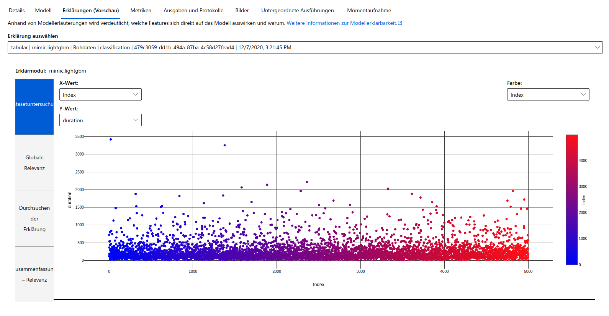
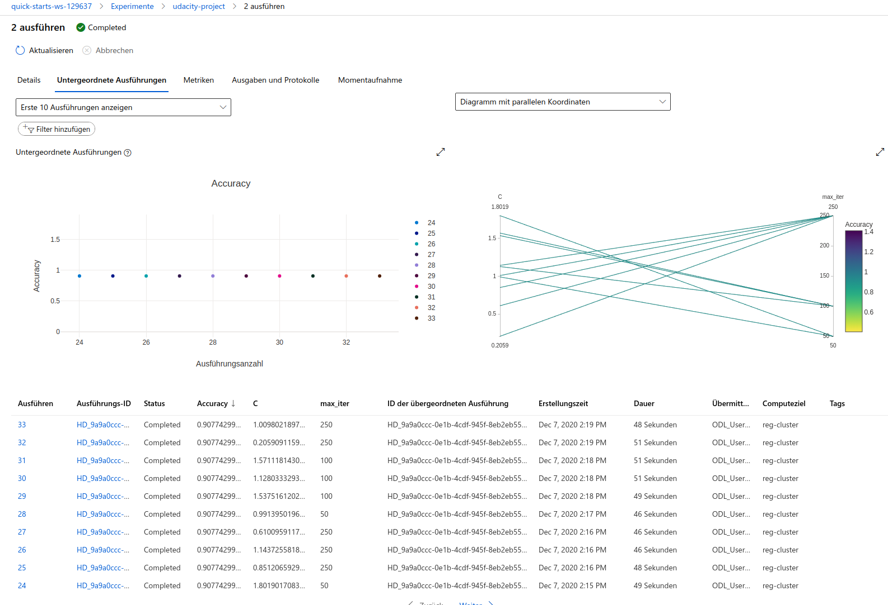
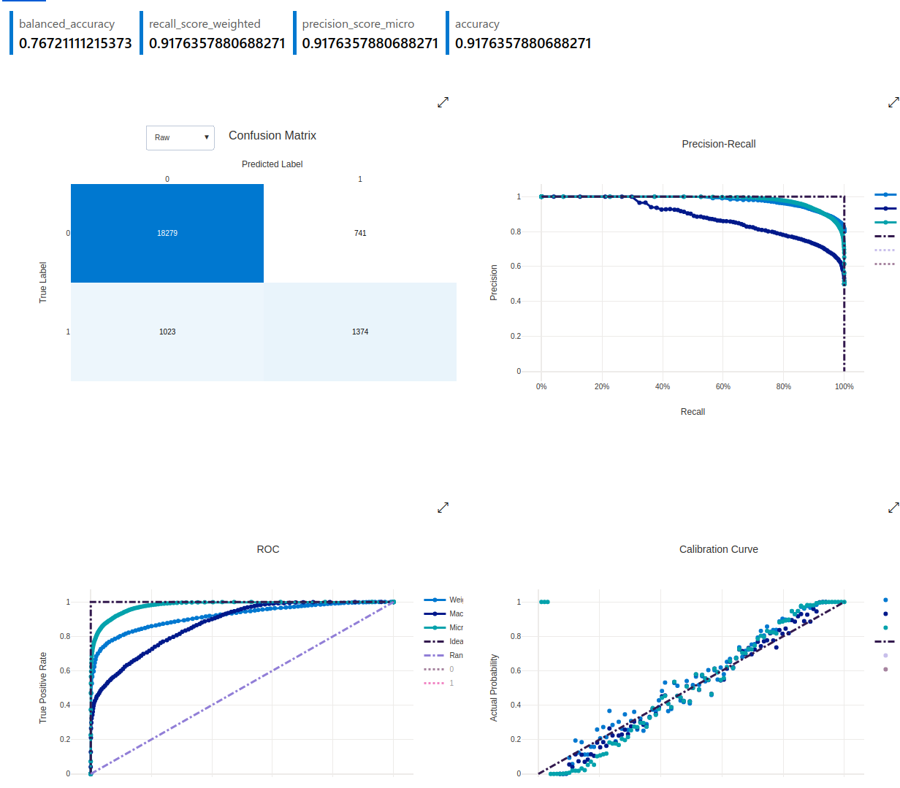
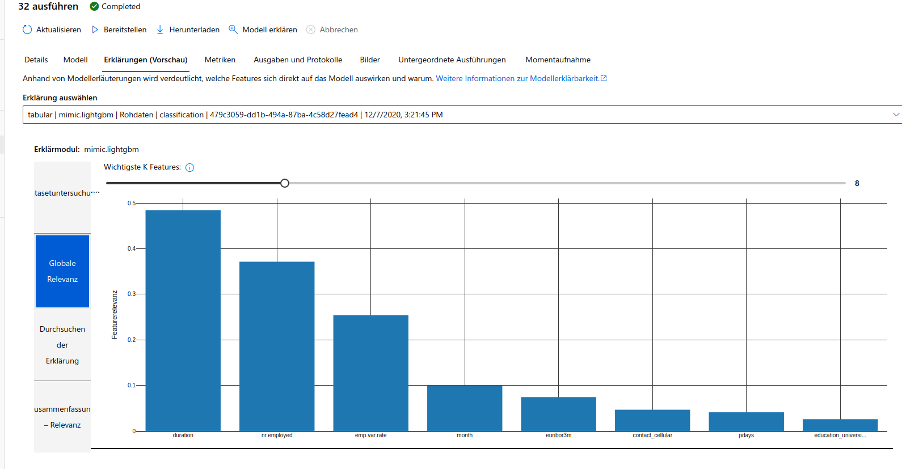

# Optimizing an ML Pipeline in Azure

## Overview
This project is part of the Udacity Azure ML Nanodegree.
In this project, we build and optimize an Azure ML pipeline using the Python SDK and a provided Scikit-learn model.
This model is then compared to an Azure AutoML run.

## Summary

### Data
This dataset contains data about a marketing campaign of a bank. Its contains information about persons such as 
job, marital, education, housing, loan and some more, 21 in total. The data is not complete and contains
many "unknown" fields.  It can be found at [UC Irvine Machine Learning Repository](http://archive.ics.uci.edu/ml/datasets/Bank+Marketing#)
and was originally published for the paper ["A Data-Driven Approach to Predict the Success of Bank Telemarketing"](https://repositorio.iscte-iul.pt/bitstream/10071/9499/5/dss_v3.pdf)
by Sergio Moro, Paulo Cortez and Paulo Rita.

We seek to predict "y" which answers "Has the client subscribed a term deposit?" (binary: 'yes', 'no')

### Best model
The best performing model was the "VotingEnsemble" model created by automl with accuracy of 0.9176357880688271

## Scikit-learn Pipeline

### Explanation of the pipeline architecture, including data, hyperparameter tuning, and classification algorithm.
 
* load data into TabularDatasetFactory from provided URL
 * cleanup data e.g. drop job 
 * replace strings of month/weekday by int values
 * replace yes/no by 1/0 in data
 * split data in train and validation
 * use LogisticRegression as classification algorithm
 * use C (inverse of regularization strength) and max_iter (max iteration number) as hyperparameters'
 * run training
 * dump model

#### parameter sampler
I used **RandomParameterSampling** because I needed a way to put the hyperparameters c and max_iter to
the train scrip. The benefit of the RandomParameterSampling is that enables a random selection from a search
space which helps to identify low performing models for saving time and money by an early termination of these. 
I used uniform(0.1, 2.0) for C which is a continuous hyperparameter search, the interval 0.1,2.0 is 
around the default of 1.0.

For max_iter I used the discrete search by choice(50, 100, 250) which look like a good starting point.

#### early stopping policy
I used the **BanditPolicy** as it can provide a threshold (slack_factor) for the allowable slack as a ration 
but also can use the delay_evaluation to avoid premature termination of training runs. This helps to 
terminate bad performing runs and improves efficiency.

## AutoML
config:
* experiment_timeout_minutes=30
* primary_metric='accuracy'
* target label_column_name='y',
* n_cross_validations=5

The best model find by AutoML was the "VotingEnsemble" model with an accuracy of 
0.9176357880688271. VotingEnsemble uses multiple models and votes on the predictions of
these to get a final prediction. It uses LightGBMClassifier, XGBoostClassifier, SGDClassifier and some more,
check the [model.txt](outputs/model.txt) file with a print of the VotingEnsemble for more details.

## Pipeline comparison
For booth approaches we use a cleanup of the data beforehand, but AutoML could to this as well. 
The setup for AutoML is much shorter than for HyperDrive, but it needed longer to find the best model.
The accuracy of both is nearly the same. AutoML shows that duration is the most important feature.

## Future work
Try to fine tune the found parameters by HyperDrive more or use other hyperparameter 
like learning_rate, batch_size to increase the accuracy.
Increase the timeout of AutoML to give it more time to tryout different types of models and
hyperparameters with better accuracy.
